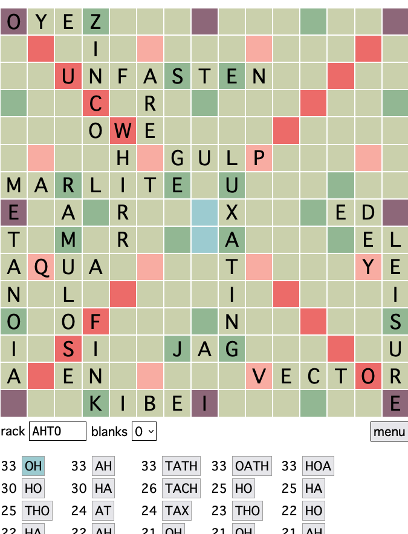

# Scrabble Oracle

<a href="https://jzwood.github.io/scrabble-oracle/" target="_blank">
   
</a>

## About

Scrabble Oracle finds the best plays given a scrabble board and rack.

## Development

```sh
gleam test
gleam build
```

```sh
./bin/format  # formats JS code
./bin/local   # runs dev server
./bin/bump    # increments version
```

## Algorithm

1. precompute trie from word list.
2. get coordinates (aka playspot) of every legal place to play (i.e. physically
   legal, no dictionary checks yet)
   - filter each playspot by 3 criteria:
     - is at least one playspot cell empty?
     - is at least one playspot cell perpendicularly adjacent to an already
       played word?
     - is the playspot not a subword? ie the square before first letter and
       after last letter empty?
3. pair every playspot with their corresponding cloze on the board
   - `#(playspot, cloze)`
4. group these pairings by cloze
   - now each cloze will be associated with 1+ playspots
   - `dict(cloze, list(playspot))`
5. for every cloze find every dictionary valid word that is compatible with
   cloze and rack (on main axis)
   - by exploring trie
6. flatten into `#(playspot, word)` pairs
   - `#(list(playspots), list(word)) -> list(#(playspot, word))`
7. remove from `#(playspot, word)` list any pairing that, if played, produces a
   word not in the dictionary (on cross-axis)
8. score all remaining valid playable spots and order from highest point value
   to lowest

## Terminology

- Cloze
  - a string with unknown characters
  - e.g. `HE__O`, `W_RLD`

- Playspot
  - a list of cells
  - e.g. `[(x,y),(x,y),(x,y),(x,y),(x,y),(x,y),(x,y),(x,y)]`

## Prior Art

- https://www.cs.cmu.edu/afs/cs/academic/class/15451-s06/www/lectures/scrabble.pdf
- https://github.com/jzwood/ScrabbleOracle
